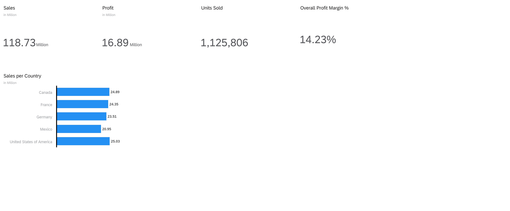
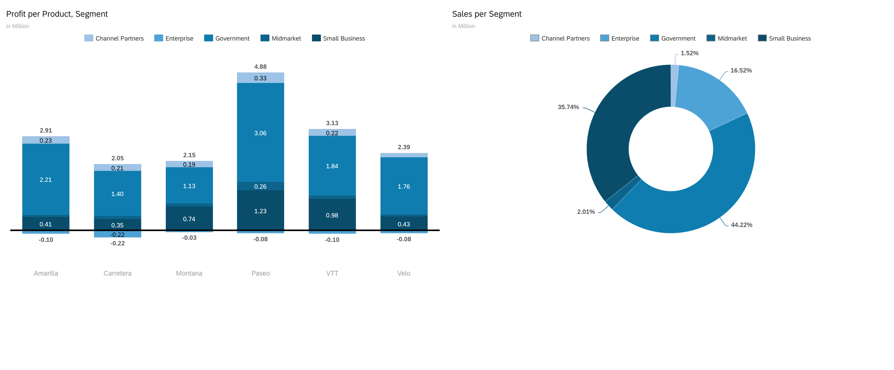
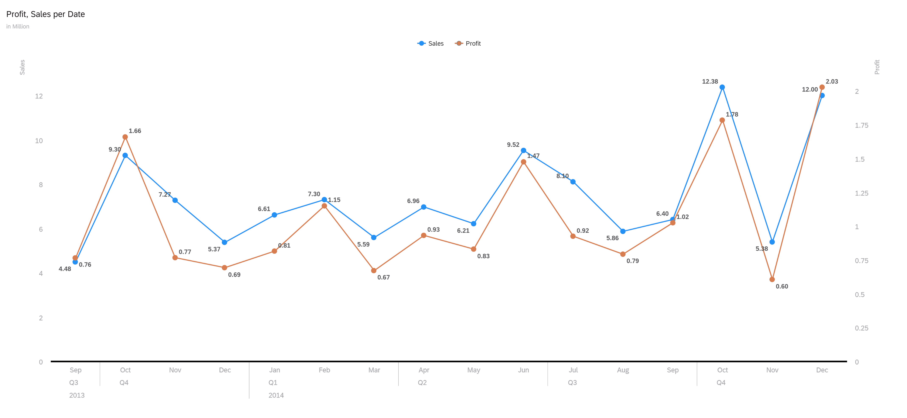
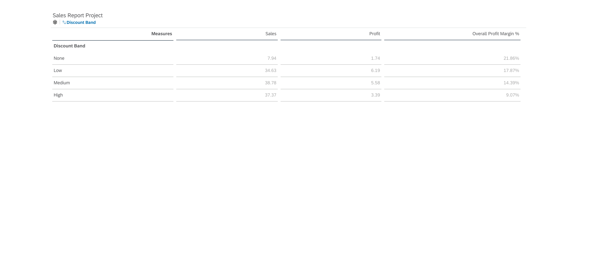
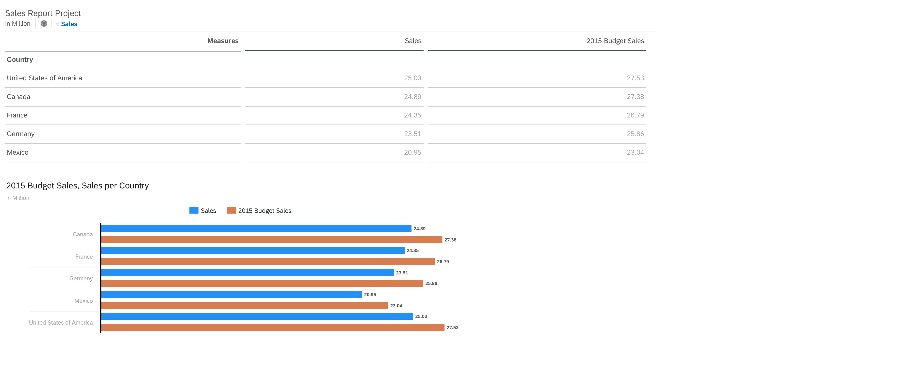

# SAP Analytics Cloud — Global Sales Performance Dashboard

## Overview

This project demonstrates end-to-end SAP Analytics Cloud (SAC) skills through a 5-page interactive Sales Analytics and Budget Planning dashboard built on a multinational sales dataset (2013–2014).

- **Tool:** SAP Analytics Cloud (SAC)
- **Dataset:** Financial Sample — 700 records, 5 countries, 6 products, 5 segments
- **Skills:** Data Modeling, Story Design, Calculated Measures, Budget Planning, Version Management

## Dashboard Pages

| # | Page | Description |
|---|---|---|
| 1 | Executive Overview | KPI tiles (Sales, Profit, Units Sold, Margin) + Sales by Country |
| 2 | Product Performance | Profit by Product/Segment (stacked bar) + Sales by Segment (donut) |
| 3 | Trend Analysis | Monthly Sales & Profit trend — 2013 vs 2014 (dual-line chart) |
| 4 | Discount Impact | Profit margin erosion across discount bands (interactive table) |
| 5 | Budget Planning | 2014 Actual vs 2015 Budget comparison (table + grouped bar chart) |

## Key Insights

- **USA and Canada** lead in revenue at 25.03M and 24.89M respectively
- **Paseo** is the highest profit-generating product (4.88M)
- **Channel Partners** segment records losses across all 6 products despite 16.52% sales share
- **October–December seasonal pattern** observed consistently in both 2013 and 2014
- **Profit margin drops from 21.86% → 9.07%** as discount band increases from None → High

## Features

- Interactive SAC Story with 5 dashboard pages
- Calculated measure: Overall Profit Margin % = SUM(Profit) / SUM(Sales)
- Budget version (2015_Budget) created using SAC Planning capabilities
- 10% revenue growth forecast applied across all 5 countries
- Millions-scaled formatting for clean, professional readability

## Technologies Used

- SAP Analytics Cloud (SAC) — Story Design & Manual Planning
- Microsoft Excel — Data cleaning and preparation
- SAP Learning Hub — SAC Learning Journey (4 badges completed)

## SAC Badges Earned

- Designing Stories in SAP Analytics Cloud
- Performing Manual Planning with SAP Analytics Cloud
- Exploring SAP Analytics Cloud
- Introduction to SAP Business Data Cloud (BDC)
- Pursuing: SAP Certified Associate — C_SAC_2415

## Setup Instructions

1. Download `data/Global_Sales_Data.xlsx`
2. Log into SAP Analytics Cloud → Create → Model → Start with data → Upload file
3. Map dimensions: Segment, Country, Product, Discount Band, Date, Year, Month
4. Map measures: Sales, Profit, COGS, Units Sold, Gross Sales, Discounts
5. Create calculated measure: `Overall Profit Margin %` = `[Sales Report Project:Profit]/[Sales Report Project:Sales]`
6. Create new Story → build 5 pages as documented above
7. Enable Planning → create Budget version → add 2015 Budget Sales calculated measure (`Sales * 1.1`)

## Dashboard Screenshots

### Page 1 — Executive Overview

### Page 2 — Product Performance

### Page 3 — Trend Analysis

### Page 4 — Discount Impact

### Page 5 — Budget Planning

## Author

**Akash Saravanan**
- GitHub: [github.com/akash262003](https://github.com/akash262003)
- LinkedIn: [linkedin.com/in/akash26623](https://linkedin.com/in/akash26623)
- Email: akash26623@gmail.com
